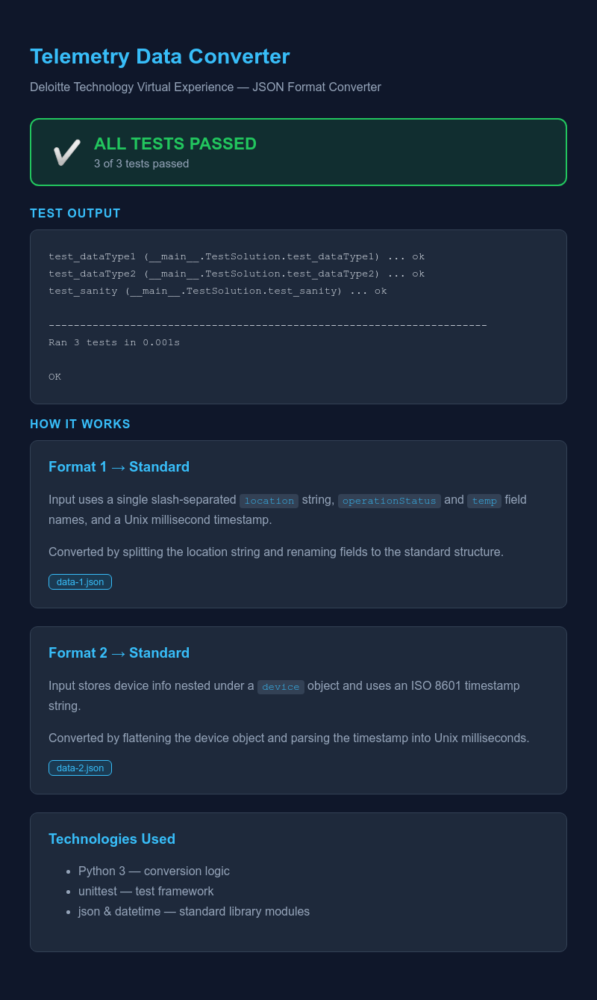

# Telemetry Data Converter

A responsive web application that converts IoT telemetry data from multiple JSON formats into a single standardized structure for easier processing, validation, and analysis.

## 🌐 Live Demo

**GitHub Pages:**
https://agrima044.github.io/telemetry-data-converter-task/

---

## 📸 Preview



---

## ✨ Features

* Converts telemetry data from two different JSON formats
* Automatically detects the input format
* Standardizes device information into a unified JSON schema
* Converts ISO 8601 timestamps into Unix milliseconds
* Displays test results through a responsive web interface
* Includes Python implementation with automated unit tests
* Clean, responsive UI built with HTML, CSS, and JavaScript

---

## 🛠️ Tech Stack

### Frontend

* HTML5
* CSS3
* JavaScript

### Backend Logic

* Python 3
* JSON
* datetime
* unittest

---

## 📂 Project Structure

```text
Telemetry-Data-Converter/
│
├── index.html
├── style.css
├── script.js
│
├── preview/
│   └── telemetry-data-converter-preview.png
│
├── python-version/
│   ├── main.py
│   ├── data-1.json
│   ├── data-2.json
│   └── data-result.json
│
└── README.md
```

---

## 🔄 Supported Input Formats

### Format 1

* Flat device information
* Slash-separated location string
* Unix timestamp
* `operationStatus`
* `temp`

### Format 2

* Nested device object
* Separate location fields
* ISO 8601 timestamp
* Standard telemetry object

Both formats are converted into a consistent output containing:

* Device ID
* Device Type
* Unix timestamp
* Structured location object
* Standardized telemetry data

---

## 📋 Standard Output

```json
{
  "deviceID": "...",
  "deviceType": "...",
  "timestamp": 1624445837783,
  "location": {
    "country": "...",
    "city": "...",
    "area": "...",
    "factory": "...",
    "section": "..."
  },
  "data": {
    "status": "...",
    "temperature": 22
  }
}
```

---

## 🚀 Running the Project

### Web Version

Open `index.html` in your browser or visit the live demo.

### Python Version

```bash
cd python-version
python3 main.py
```

---

## ✅ Unit Tests

The project includes automated tests to verify the conversion logic.

* ✔️ Sanity Test
* ✔️ Format 1 Conversion
* ✔️ Format 2 Conversion

Run the tests using:

```bash
python3 main.py
```

---

## 🎯 What I Practiced

* JSON data transformation
* Data normalization
* Python programming
* Unit testing
* Responsive web development
* DOM manipulation
* GitHub Pages deployment
* Clean project organization

---

## 👩‍💻 Author

**agrima044**

## Live Demo

https://left-concerned-gnudebugger--kuhu04.replit.app

https://agrima044.github.io/telemetry-data-converter-task/
